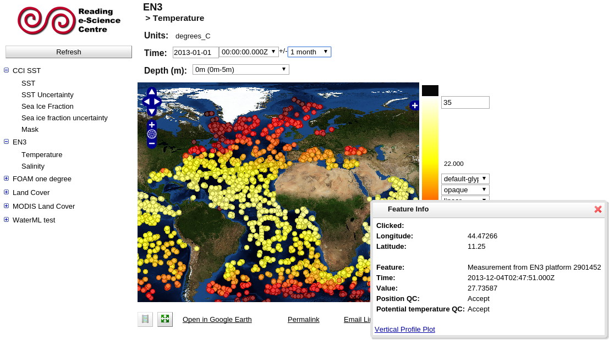

# Configuration

Configuration of ncWMS is performed by either accessing the administration web interface ([http://serveraddress/ncWMS2/admin/](http://localhost:8080/ncWMS2/admin/)) or by directly modifying `config.xml` in the configuration directory. It is recommended to use the web interface - precise documentation of the XML configuration file is beyond the scope of this guide.

Once any changes have been made on this page, click the "Save configuration" button to apply them.

## Adding datasets {#datasets}

On the admin page, new datasets can be added by filling in the information in the "Required Data" column of the Datasets section. All other fields are optional. Already-configured datasets can be modified here.

### Required Data

* ID: An alphanumeric identifier for the dataset. This must be unique on the server.
* Title: The title of the dataset. This is displayed in menus etc. on the user interface.
* Location: The location of the dataset. This should be either a location on disk or an OPeNDAP URL. _Note that locations should use slashes - not backslashes - regardless of operating system_. For example, on Windows a path such as `C:/Data/dataset.nc` should be used. If referring to a location on disk, glob expressions of the form `/mnt/data/dataset/**/**/*.nc` are valid. If such an expression refers to multiple NetCDF files, they will be interpreted as having non-overlapping time axes. Any other configuration of data spanning multiple files is not supported, although ncWMS2 does have support for [NcML](http://www.unidata.ucar.edu/software/thredds/current/netcdf-java/ncml/) for more complex aggregations.  If you are using NcML, the .ncml file should be referenced in the location field.

### Optional Metadata

* More Info URL: A URL containing more information about the dataset. This will appear when clicking the information button in the web interface.
* Copyright: The copyright information for the dataset. This will appear when clicking the information button in the web interface as well as on graphs generated by ncWMS.

### Status

Status information about the dataset will appear here

### Refresh

* Auto-refresh rate: Specifies how regularly the dataset will be scanned for changes
* Force refresh: By ticking this box and saving the configuration, the dataset will be refreshed immediately

### Options:

* Disabled: Disables this dataset but keeps the configuration intact
* Queryable: Whether or not to allow GetFeatureInfo requests to this dataset
* Downloadable: Whether or not to allow data download for this dataset

### Data reading class:

This is the Java class which should be used to read the data. This should be left blank to use the default gridded NetCDF data reader. ncWMS2 also provides the reader `uk.ac.rdg.resc.edal.dataset.cdm.En3DatasetFactory` for reading data from the UK Met Office EN3/EN4 dataset ([http://www.metoffice.gov.uk/hadobs/en4/](http://www.metoffice.gov.uk/hadobs/en4/)). For custom data types you specify their class name here (see [Development](./06-development.md) section for more information)

### Remove?

Tick this box to completely remove this dataset from the configuration

## Configuring variables {#variables}

Once a dataset has been added, a link will appear in the "Edit variables" column. By clicking this, all of the variables within the dataset can be individually configured. The properties which can be adjusted are:

* Title: The title of the variable to appear in menus / the capabilities document
* Default colour scale range: This is the value range which the data covers. When a dataset is added, this is populated with a range based upon a small sample of the data
* Default palette: The name of default colour palette to use. Available palettes can be browsed in the Godiva interface by clicking on the colour bar. The names of the palettes can be found by hovering over them.
* Default number of colour bands: The number of gradations of colour to use when plotting the variable. Must be between 2 and 250.
* Default scaling: Whether to plot data on a linear or a logarithmic colour scale.

## Dynamic services {#dynamic}

Dynamic services are equivalent to datasets but are not pre-indexed. This allows users to access potentially very large numbers of files without having to configure them. An explanation of dynamic services is provided on the administration interface and their configuration is very similar to that of standard datasets.

## Other server settings {#server}

### Cache

To increase speed, ncWMS uses a cache of recently-extracted data. Enabling/disabling the cache can be done here, as well as configuration of how much memory the cache is allow to consume. The higher this is, the more features will be cached.

### Server settings

* Title: The server name, which will be the title of the Godiva interface, and will also appear in the capabilities document
* Abstract: Description of the purpose of this server - appears in the capabilities document
* Keywords: Keywords describing this server - appear in the capabilities document
* URL: A URL of the service provider - appears in the capabilities document
* Max image width: The maximum allowable width (in pixels) which can be requested in a GetMap call
* Max image height: The maximum allowable height (in pixels) which can be requested in a GetMap call
* Allow GetFeatureInfo: This can be used to disable GetFeatureInfo requests globally on the server. If this is enabled, individual datasets can still have GetFeatureInfo disabled using the "Queryable" option
* Allow global capabilities: Allows clients to request a WMS Capabilities document including all datasets on the server

### Contact information

This configures the contact information which will appear in the capabilities document