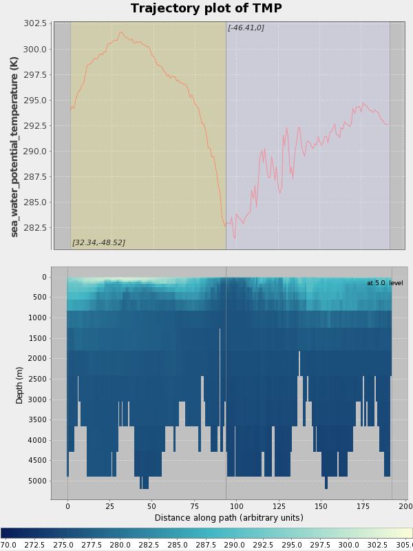

# Usage

## Standard WMS {#wms}

ncWMS provides the three mandatory methods of the WMS specification and should work with any standard WMS client. However, it also accepts a number of additional parameters for finer control of the images produced.

In ncWMS, the WMS layer names are of the form `datasetId/variableId`.

When colours can be specified, there are three main ways of describing them:
* 0xRRGGBB: Hexadecimal representation of the red, green, and blue components of the colour respectively.  For example 0x000000 represents black, 0xFF0000 represents 100% red, etc.
* 0xAARRGGBB: Hexadecimal representation of the alpha, red, green, and blue components
* Named colours. The special value "transparent" is supported, as are another 865 named colours. The full list of these can be found [here](../appendices/named_colours.md)

### GetMap

All of the standard parameters for GetMap are supported on ncWMS. Additional notes on some of these:

* FORMAT: The supported formats are:
    * image/png
    * image/png;mode=32bit
    * image/gif
    * image/jpeg
    * application/vnd.google-earth.kmz
* TIME: For gridded data with a discrete time axis this takes a single value. For in-situ data which is spread over a range, it is more useful to provide a time range in the form `starttime/endtime`. This should ideally be used in conjunction with the TARGETTIME parameter (see below)
* ELEVATION: For gridded data with a discrete vertical axis this takes a single value. For in-situ data which is spread over a range, it is more useful to provide an elevation range in the form `startelevation/endelevation`. This should ideally be used in conjunction with the TARGETELEVATION parameter (see below)
* STYLES: Available styles can be found from the Capabilities document.  Generally styles are of the form `stylename/palettename`, and the style name `default` is always available.  The available palettes can be seen in the following image, and additional palettes can be added by following the instructions [here](06-development.md#palettes):

In additional to the standard GetMap parameters, ncWMS accepts the following optional additional parameters. If not specified, the server-configured defaults are used:

* COLORSCALERANGE: Of the form `min,max` this is the scale range used for plotting the data.
* NUMCOLORBANDS: The number of discrete colours to plot the data. Must be between 2 and 250
* ABOVEMAXCOLOR: The colour to plot values which are above the maximum end of the scale range. Colours are as defined above, with the addition of "extend", which will use the maximum value of the palette.
* BELOWMINCOLOR: The colour to plot values which are below the minimum end of the scale range. Colours are as defined above, with the addition of "extend", which will use the minimum value of the palette.
* LOGSCALE: "true" or "false" - whether to plot data with a logarithmic scale
* TARGETTIME: For in-situ data, all points which fall within the time range (specified in the TIME parameter) will be plotted. In the case that an in-situ point has multiple time readings within that range, the colour used to plot them will depend on the time value which is closest to this given value
* TARGETELEVATION: For in-situ data, all points which fall within the elevation range (specified in the ELEVATION parameter) will be plotted. In the case that an in-situ point has multiple elevation readings within that range, the colour used to plot them will depend on the elevation value which is closest to this given value
* OPACITY: The percentage opacity of the final output image
* ANIMATION: "true" or "false" - whether to generate an animation. This also needs the TIME to be of the form`starttime/endtime`, and currently is only implemented for features with a discrete time axis.

### GetFeatureInfo

The GetFeatureInfo request works as per the standard WMS, with the following notable points:

* INFO_FORMAT: `text/xml` and `text/plain` are supported
* For in-situ (i.e. non-gridded) datasets, all features within a 9-pixel box of the click position are returned, up to the maximum specified by FEATURE_COUNT.

### GetCapabilities

The GetCapabilities request works as per the standard WMS, with the following additional optional parameter:

* DATASET: If this is present, a capabilities document will be returned containing only layers which are present within the given dataset ID

## ncWMS Extensions {#extensions}

In additional to the standard WMS methods, ncWMS provides a number of additional requests. These all take the standard WMS parameters of `SERVICE=WMS`, `VERSION`, and `REQUEST`. The following are the valid values for the `REQUEST` parameter:

### GetTimeseries

This produces either a timeseries graph or, if downloading is enabled, a CSV file containing the data. The URL parameters are identical to those of a GetFeatureInfo request. The `TIME` parameter should specify a range of times in the form `starttime/endtime`, and the supported formats are:

* image/png
* image/jpg
* image/jpeg
* text/csv

### GetVerticalProfile

This produces either a vertical profile graph or, if downloading is enabled, a CSV file containing the data. The URL parameters are identical to those of a GetFeatureInfo request. The `ELEVATION` parameter should specify a range of elevations in the form `startelevation/endelevation`, and the supported formats are:

* image/png
* image/jpg
* image/jpeg
* text/csv

### GetTransect

This produces a graph of data values along an arbitrary path. Additionally if there is vertical information present in the dataset, it will produce a vertical section along the same path.

It takes the same URL parameters as a GetMap request with the addition of a parameter `LINESTRING` of the format `x1 y1,x2 y2,x3 y3...` which defines the control points of the graph.

### GetMetadata

The GetMetadata request is used to request small pieces of metadata from ncWMS. Many of these are also present in the capabilities document, but GetMetadata provides a more convenient method of accessing such data. GetMetadata always returns data in the JSON format. All GetMetadata requests must provide the parameter `ITEM` which states the type of metadata requested. `ITEM` can take the following values:

* menu: Returns a tree representation of the available WMS layers, with IDs. Takes the optional parameter `DATASET` to return the same tree for a single dataset
* layerDetails: Returns a set of details needed to plot a given layer. This includes such data as units, layer bounding box, configured scale range, etc. Takes the parameters `LAYERNAME` and `TIME`. The `TIME` parameter is optional, and if it is specified then the nearest available time is returned as part of the layer’s details.
* minmax: Calculates the range of values in the given area. Takes the same parameters as a GetMap request.
* timesteps: Returns the available times for a given day. Takes the parameters `LAYERNAME` and `DAY` (yyyy-mm-dd)
* animationTimesteps: Returns a list of time strings at different temporal resolutions for a given time range. This is used to present to the user different frequencies for the generation of an animation. Takes the parameters `LAYERNAME`, `START`, and `END`

### GetLegendGraphic

The GetLegendGraphic request generates an image which can be used as a legend. There are two main options: Generating just a colourbar, and generating a full legend. In the first case (the URL parameter `COLORBARONLY` is set to "true"), the following URL parameters are used:

* PALETTE: The name of the palette to use. If missing, set to "default"
* NUMCOLORBANDS: The number of colour bands to use. If missing, set to 250
* VERTICAL: Whether to very colours vertically. If missing, defaults to true
* WIDTH: The width of the image to generate. If missing, defaults to 50
* HEIGHT: The height of the image to generate. If missing, defaults to 200

For a full legend, the additional parameters `LAYERS` and either `STYLES`, `SLD`, or `SLD_BODY` must be supplied. This is because a single WMS layer may depend on an arbitrary number of sub-layers, depending on the style it is plotted in. In addition to these parameters, the optional parameters controlling the style may be supplied (these are the same as documented in the GetMap request):

* COLORSCALERANGE
* NUMCOLORBANDS
* ABOVEMAXCOLOR
* BELOWMINCOLOR
* LOGSCALE

Note that for full legends, the supplied width and height are NOT the final height of the image, but rather the width and height of each individual coloured plot area (i.e. the 1d/2d colourbar)

## Godiva3 {#godiva3}

Normal access to the WMS is done using a web client. ncWMS comes with Godiva3 - a WMS client written to take advantage of all of the extended WMS methods in ncWMS. It is accessed at [http://serveraddress/ncWMS2/Godiva.html](http://serveraddress/ncWMS2/Godiva.html)

Most of the controls on the Godiva3 interface have tool tips to help you: hover the mouse over the control in question to find out what it does.

### Basic usage

Use the left-hand menu to select a variable for viewing (click on the variable’s name in the tree view). The data should appear on the interactive map after a short delay (a progress bar may appear showing the progress of loading image tiles from the ncWMS server(s)).

### Navigating the map

The interactive map can be dragged with the mouse to navigate around. Using the controls in the top left of the map you can zoom in and out. You can zoom quickly to a particular area by holding down Shift and dragging a rectangle on the map. You can automatically centre the current data overlay on the map by clicking the "Fit layer" button (below the map, the button with 4 divergent arrows).

### Selecting the vertical level

If the variable you are viewing has a vertical dimension you will be able to select the vertical level using the drop-down "Elevation / Depth" box above the map.

### Selecting the timestep

If the displayed variable has a time dimension you will be able to select the date and time using the drop-down "Time" box above the map

### Finding the data value at a point

Once a variable has been displayed on the map, you can click on the map to discover the data value at that point. The data value, along with the latitude and longitude of the point you clicked, will appear in a small pop-up window at the point where you clicked, as well as links to generate timeseries / vertical profile plots.

### Changing the style of the data display

#### Adjusting the colour contrast range

When you first load up a variable it will appear with a default colour scale range. This range may not be appropriate for the geographical region and timestep you are interested in. By clicking the "auto" button (the colour-wheel button to the right of the colour bar) the colour scale range will be automatically stretched to suit the data currently displayed in the map. You can also manually change the colour scale range by editing the values at the top and bottom of the colour scale bar.

#### Locking the scale range

Sometimes, when comparing two datasets, you might want to fix the colour scale range so that when you select a new variable, that variable is shaded with exactly the same colour scale. To do this, click the "lock" button link (the padlock button to the right of the colour bar). The colour scale range will then not be changed when a new variable is loaded and the scale range cannot be edited manually. Click the button again to unlock the colour scale.

#### Changing the colour palette

The colour palette can be changed by clicking on the colour scale bar. A pop-up window will appear with the available palettes. Clicking the "Flip" button will invert all of the palettes. Click on one to load the new palette. The window also contains a drop-down box to select the number of colour bands to use, from 10 (giving a contoured appearance) to 250 (smoothed).

#### Changing plotting style

The style used to plot the variable can be adjusted using the topmost of the 3 drop-down boxes to the right of the colour bar. All styles which are compatible with the displayed data will be available, although not necessarily appropriate (for example, arrows are compatible with any scalar data type, but only meaningful when that data represents a direction in degrees).

#### Changing layer opacity

The overall opacity of the WMS layer can be adjusted using the drop-down box to the right of the colour bar.

#### Changing scaling

Certain variables, particularly biological parameters, are best displayed with a logarithmic colour scale. The spacing of the colour scale can be toggled between linear and logarithmic using the drop-down box to the right of the colour bar. Note that you cannot select a logarithmic scale if the colour scale range contains negative or zero values.

### Creating animations

To create an animation, click the filmstrip button below the map. This will bring up a wizard allowing you to select the start and end times, followed by the number of frames to generate and the frame rate for playback. This may take a long time to generate, depending on the number of frames and the data resolution. Once playing, the animation can be stopped by clicking the same button.

### Vertical sections and transects along arbitrary paths

At the top of the map itself, select the icon that looks like a line joining four points. Click on the map to start drawing a line. Add "waypoints" along this line by single-clicking at each point. Double-click to finish the line. A pop-up will appear showing the variation of the viewed variable along the line (i.e. a transect plot). If the variable has a vertical dimension, a vertical section plot will appear under the transect plot.

### Changing the background map

A selection of background maps are available on which data can be projected. Select a different background map by clicking the small plus sign in the top right-hand corner of the interactive map.

### Changing the map projection

The map projection is changed by selecting a new background map as above. If the background map is in a different projection then the data overlay will be automatically reprojected into the new coordinate system. Commonly, Godiva3 websites will give the option to select a background map in north or south polar stereographic projection. There may be a delay before the map appears in the new projection.

### Saving and emailing the view

You may wish to save the current view to return to it later or share it with a colleague. The "Permalink" under the bottom right-hand corner of the map links to a complete URL that, when loaded, recreates the current view. Left-click on the permalink to bring up a new window with an identical view. Right-click on the permalink and select "Copy link location" or the equivalent for your web browser. You can then paste the link into a report, your notes or an email. You can also click on "email" (next to the permalink) to start a new email message in your default email client with the permalink already included in the message body.

### Exporting to a map

By clicking the "Export to PNG" link below the map, a static image of the current view will be generated, which can be saved from your browser.
