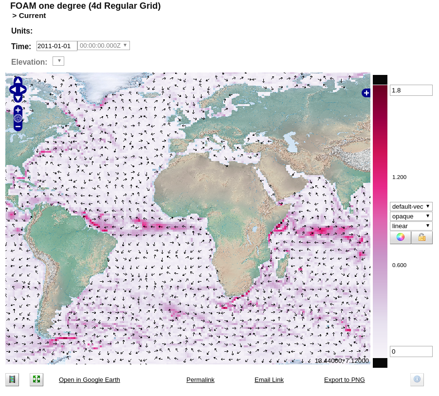
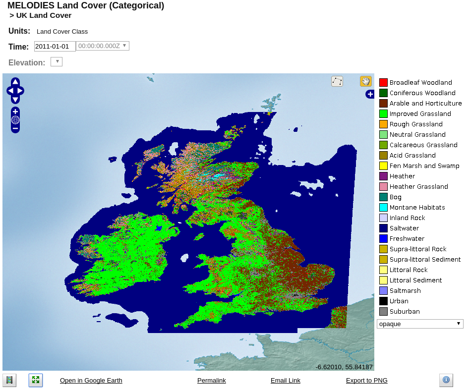

# Data Formats

Whilst focused primarily on reading NetCDF data, ncWMS uses the [Unidata NetCDF Java libraries](http://www.unidata.ucar.edu/software/thredds/current/netcdf-java/) to do so, and hence supports a number of different [file formats](http://www.unidata.ucar.edu/software/thredds/current/netcdf-java/reference/formats/FileTypes.html). The detail of all of these file format is beyond the scope of this guide. This section outlines the metadata conventions which ncWMS supports within any of these formats.

## CF (Climate and Forecast) Conventions {#cf}
The [CF conventions](http://cfconventions.org/) are the primary standard used in ncWMS. Environmental data should follow these conventions if they are to be displayed correctly in ncWMS. In particular, co-ordinate axes are identified by their units, and the omission of units on a co-ordinate axis will most likely lead to data not being available in ncWMS.

There are CF compliance checkers available from the [CF conventions website](http://cfconventions.org/compliance-checker.html).

## Vector Data {#vector}
Vector data in NetCDF files is usually stored in terms of the vector components.  As per the CF conventions each variable should, if possible, define an attribute of `standard_name` from the [CF standard name table](http://cfconventions.org/Data/cf-standard-names/33/build/cf-standard-name-table.html) to denote what the variable represents.

Provided that the `standard_name` components are of the form `.*eastward_.*`/`.*northward.*` or `u-.*component`/`v-.*component`, ncWMS will automatically detect that these are vector fields. It will group these variables together under a parent group which will also contain dynamically-generated fields for the magnitude and direction. Clicking the parent group in [Godiva3](04-usage.md#godiva3) will plot both magnitude and direction simultaneously, with a number of different styles available.



## Categorical Data {#categorical}
There is also support for categorical data in ncWMS. This uses the CF-defined attributes `flag_values` and `flag_meanings`. As per the CF-conventions, `flag_values` should contain a comma-separated list of the valid numerical values for the categorical data. `flag_meanings` should contain a single string with space-separated identifiers of what these values represent.  In `flag_meanings`, underscores should be used to separate words in a single description - these will then be converted to spaces for display.

Additionally we define another 2 optional attributes for use with categorical data.  The first, `flag_namespace` will be prepended to all of the `flag_meanings` values in the category ID in the Parameter. Whilst this is not currently used in ncWMS, it is exposed by the EDAL libraries and may be used to define unique identifiers for categorical data for use in e.g. linked-data applications.

The second optional attribute is the `flag_colours` attribute, which should contain a list of space-separated colour definitions. These will be used as the default colours for visualising categorical data in ncWMS.  A full set of categorical attributes will appear similar to this in the CDL description of the dataset:

```
land_cover:flag_values = 1, 2, 3, 4, 5, 6, 7, 8, 9, 10, 11, 12, 13, 14, 15, 16, 17, 18, 19, 20, 21, 22, 23 ;
land_cover:flag_namespace = "http://melodiesproject.eu/datasets/WP3/land-cover/def#" ;
land_cover:flag_meanings = "Broadleaf_Woodland Coniferous_Woodland Arable_and_Horticulture Improved_Grassland Rough_Grassland Neutral_Grassland Calcareous_Grassland Acid_Grassland Fen_Marsh_and_Swamp Heather Heather_Grassland Bog Montane_Habitats Inland_Rock Saltwater Freshwater Supra-littoral_Rock Supra-littoral_Sediment Littoral_Rock Littoral_Sediment Saltmarsh Urban Suburban" ;
land_cover:flag_colors = "#FF0000 #006600 #732600 #00FF00 #FAAA00 #7FE57F #70A800 #998100 #FFFF00 #801A80 #E68CA6 #008073 #00FFFF #D2D2FF #000080 #0000FF #CCB300 #CCB300 #FFFF80 #FFFF80 #8080FF #000000 #808080" ;
``` 

Which will appear in Godiva3 as:


## Uncertainty Data {#uncertain}
There is also support for visualising gridded uncertainty data in ncWMS.  To group uncertainty data, a subset of the [NetCDF-U conventions](https://portal.opengeospatial.org/files/46702) is used.  Specifically, in the dataset containing the data, a variable with associated uncertainty should be organised as follows:
* There should be a parent grouping variable which contains no data, but has the following attributes:
    * An attribute named `ref` with the value `http://www.uncertml.org/statistics/statistics-collection`
    * An attribute named `ancillary_variables` whose values is a string with the space-separated IDs of the variables which represent the value and the error
* The variable which represents the value which has an attached uncertainty must have an attribute named `ref`, which can take the following values:
    * `http://www.uncertml.org/statistics/mean`
    * `http://www.uncertml.org/statistics/median`
    * `http://www.uncertml.org/statistics/mode`
    * `http://www.uncertml.org/statistics/moment`
* The variable which represents the uncertainty of the above value must have an attribute named `ref`, which can take the following values:
    * `http://www.uncertml.org/statistics/standard-deviation`
    * `http://www.uncertml.org/statistics/variance`
    
Data defined in this way will be automatically made available as a grouped set of variables, along with 2 additional variables representing the upper and lower bounds of the value (i.e. the value +/- its associated error).

By default, visualisation of the parent group will result in the standard raster representation of the data overlaid with a black layer whose opacity depends on the uncertainty.  In Godiva3, the uncertainty is automatically scaled.  However, for finer control, the `COLORSCALERANGE` URL parameter in `GetMap` can be extended by appending a second scale range after a semicolon.  For example: `COLORSCALERANGE=270,310;0,2` will give the main colour range as 270-310, and the uncertainty scale as 0-2.


There are also several other supported styles for visualising uncertainty:
* `uncert-confidencebounds` - This plots a series of 8x8 pixel glyphs, where the upper-left half is coloured according to the upper bound of the value, and the lower-right half is coloured accoring to the lower bound of the value.  This has the effect of producing a smooth effect in areas of low uncertainty, and a more jagged disconnected effect in areas of high uncertainty
* `uncert-contours` - This plots the values in the standard raster representation with the uncertainty values shown as contours over the top.  10 contour lines will be displayed, and the contour value range is sensitive to the `COLORSCALERANGE` extension.
* `uncert-stippled` - This plots the values in the standard raster representation with the uncertainty values shown as stippling over the top.  There are 9 levels of stippling, and the range is again sensitive to the `COLORSCALERANGE` extension.
