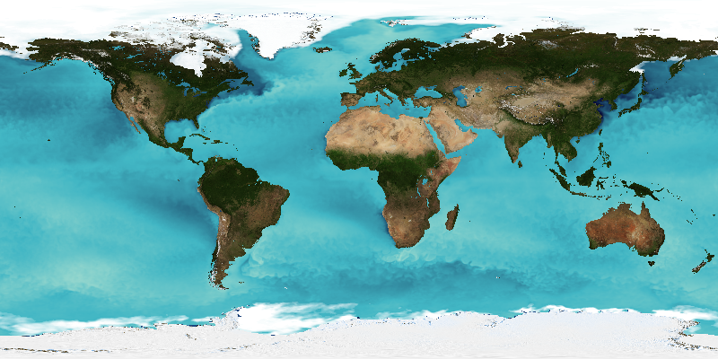

# ncWMS User Guide

This is the user guide for ncWMS - a piece of software for visualising and exploring environmental data in a browser. It can be run on a server to make your data available over the web or locally for personal use.

To see the capabilities of ncWMS, we have a [demo site available](http://godiva.rdg.ac.uk/ncWMS2/Godiva3.html)

ncWMS is a [Web Map Service](https://en.wikipedia.org/wiki/Web_Map_Service) for geospatial data that are stored in CF-compliant NetCDF files. The intention is to create a WMS that requires minimal configuration: the source data files should already contain most of the necessary metadata. ncWMS is developed and maintained by the Reading e-Science Centre ([ReSC](http://www.met.reading.ac.uk/resc/home/)) at the University of Reading, UK.

ncWMS v2 is build on top of the [EDAL](https://reading-escience-centre.gitbooks.io/edal-user-guide/content/) libraries developed by ReSC

This guide provides instructions on installing, setting up, and using ncWMS v2.

## Citing ncWMS

If you have used ncWMS as part of a project which has produced scientific papers, please cite [this paper](http://dx.doi.org/10.1016/j.envsoft.2013.04.002)

## Licence

[include](../licence.txt)

## Authors and Contributors

[@guygriffiths](https://github.com/guygriffiths)